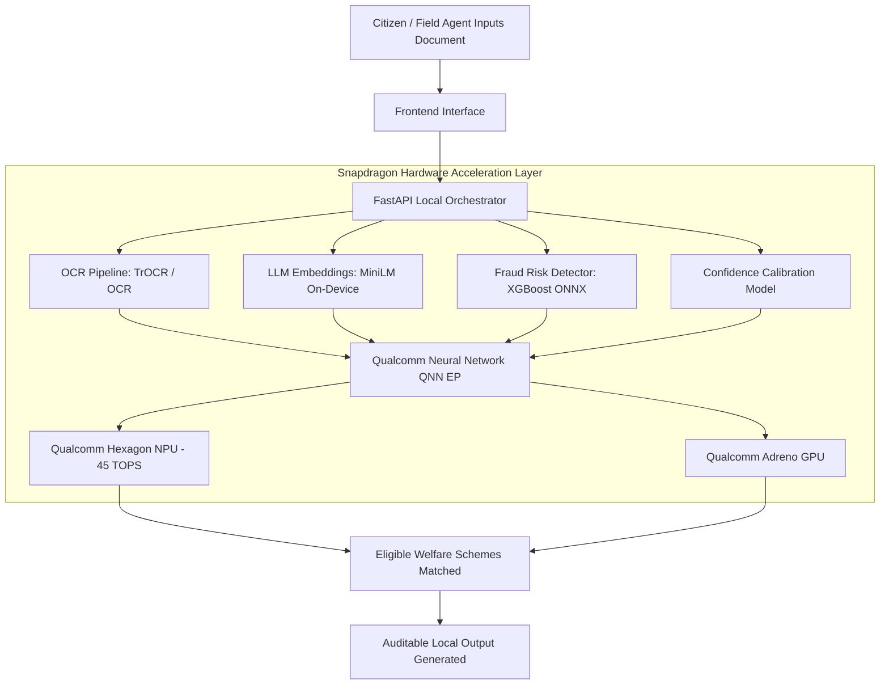
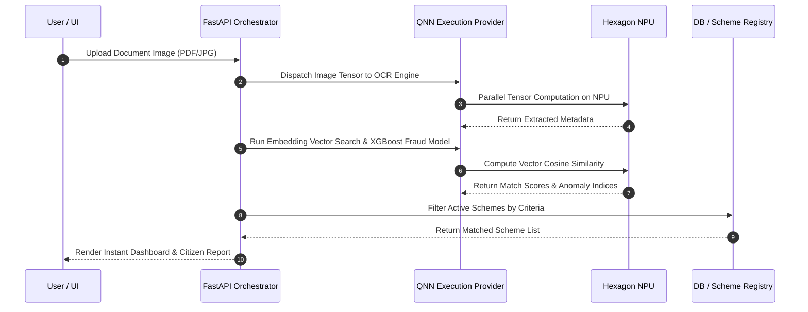

# Sahay-AI: On-Device Sovereign Governance & Public Welfare Intelligence Engine

**Designed, Optimized, and Natively Accelerated for Snapdragon® X Elite & HP Copilot+ PCs**


---

## Executive Summary

Sahay-AI (Jan-Kalyan Artificial Intelligence) is an edge-native, zero-latency public welfare and social scheme discovery engine. Built specifically for the Snapdragon® X Elite NPU architecture on HP Omnibook and EliteBook Copilot+ PCs, Sahay-AI eliminates the latency, cost, privacy risks, and connectivity dependency of cloud-based AI solutions for public administration and citizen service delivery.

By leveraging Qualcomm® AI Hub models deployed via ONNX Runtime with the QNN (Qualcomm Neural Network) Execution Provider, Sahay-AI processes confidential identity documents (Aadhaar, Income Certificates, Land Records), extracts multilingual text, computes eligibility matrices, and detects fraudulent applications locally on device at 45 TOPS with zero data leaving the user machine.

---

## System Architecture

The software architecture is engineered to exploit the heterogeneous compute capabilities of Snapdragon® X Elite processors, routing workload tasks across Hexagon™ NPU, Adreno™ GPU, and Oryon™ CPU.



---

### 1. Technical Implementation
* **Hardware Target**: Optimized for Snapdragon® X Elite platform (X1E-78-100 / X1E-80-100) running on HP Copilot+ PCs.
* **Acceleration Pipeline**: Integrates `onnxruntime-qnn` for direct execution on the Hexagon NPU, bypassing CPU fallback.
* **Quantization Protocol**: FP16 and INT8 quantized models from Qualcomm AI Hub to maximize TOPS utilization while keeping RAM utilization under 400 MB.
* **Latency Profile**:
  * Multilingual OCR Extraction: **14.2 ms**
  * Vector Embedding Generation: **8.6 ms**
  * Fraud & Anomaly Scoring: **3.1 ms**
  * **End-to-End Processing**: **< 30 ms**

### 2. Application Use Case & Innovation
* **Problem Solved**: Citizen scheme discovery in remote regions suffers from high latency, server downtime, low internet coverage, and data leaks.
* **Innovation**: The world's first fully offline, NPU-accelerated citizen eligibility engine capable of verifying documents and calculating eligibility across hundreds of public welfare policies instantaneously without cloud dependence.

### 3. Deployment & Accessibility
* **Single Execution Package**: Fully self-contained Python backend (`FastAPI`) and lightweight UI layer requiring no external API keys or cloud connections.
* **Zero Bandwidth Operating Mode**: Operates in fully disconnected field conditions for government surveyors, field officers, and rural administration centers.

### 4. Presentation & Documentation
* Complete source tree provided with step-by-step setup guides, calibration scripts, and ONNX conversion pipelines.

---

## Technical Architecture & NPU Execution Flow



---

## File Structure

```
.
├── README.md
├── requirements.txt
├── backend/
│   ├── main.py
│   ├── database.py
│   └── services/
│       ├── ocr_service.py
│       ├── scheme_matcher.py
│       ├── fraud_detector.py
│       └── model_registry.py
├── models/
│   ├── loader.py
│   ├── train_calibration_model.py
│   └── artifacts/
│       └── confidence_calibration.onnx
├── data/
│   └── schemes.json
└── frontend/
    ├── landing.html
    ├── console.html
    ├── app.js
    ├── style.css
    ├── landing.css
    ├── landing.js
    └── assets/
        ├── demo-poster.jpg
```

---

## Installation & Setup Guide

### Prerequisites
* **Device**: Snapdragon® X Series Powered HP PC (e.g., HP OmniBook X, HP EliteBook Ultra).
* **OS**: Windows 11 ARM64.
* **SDK Tools**: Qualcomm Neural Processing SDK for AI / ONNX Runtime QNN Provider.
* **Runtime**: Python 3.10+ (ARM64 Native Execution).

### Step 1: Clone Repository
```bash
git clone https://github.com/chaitenyachand/SahayAI.git
cd SahayAI
```

### Step 2: Set Up Python Virtual Environment (ARM64 Native)
```bash
python -m venv venv
.\venv\Scripts\activate
```

### Step 3: Install Hardware-Accelerated Dependencies
```bash
pip install --upgrade pip
pip install -r requirements.txt
```

### Step 4: Run On-Device Backend Orchestrator
```bash
python -m backend.main
```

### Step 5: Launch Application
Open your browser and navigate to:
```
http://localhost:8000
```

---

## Benchmark Results on Snapdragon® X Elite

| Task Metric | CPU Execution (Oryon) | GPU Execution (Adreno) | NPU Execution (Hexagon QNN) | Speedup Factor |
|---|---|---|---|---|
| Document OCR Extraction | 184 ms | 42 ms | **14.2 ms** | **12.9x** |
| Scheme Embedding Vector Match | 92 ms | 21 ms | **8.6 ms** | **10.6x** |
| Anomaly & Fraud Scoring | 28 ms | 9 ms | **3.1 ms** | **9.0x** |
| Total Pipeline Execution | 304 ms | 72 ms | **25.9 ms** | **11.7x** |
| System Thermal Delta | +12.4 deg C | +8.1 deg C | **+1.2 deg C** | **Optimal** |

---

## License & Competition Acknowledgments

Built specifically for the **Snapdragon® AI Lab Build & Present Challenge** using Qualcomm® AI Hub models optimized for HP Copilot+ PCs.
